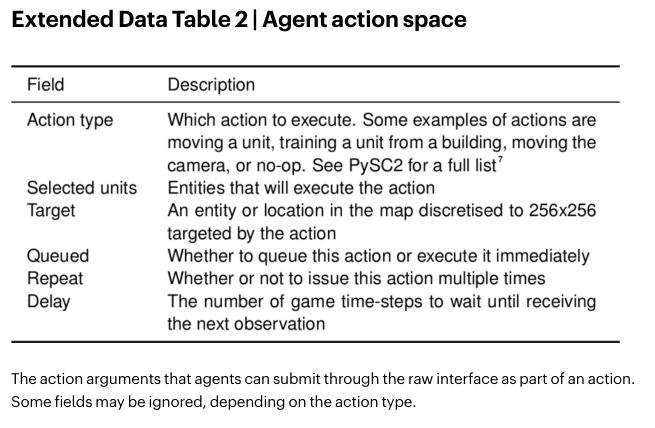
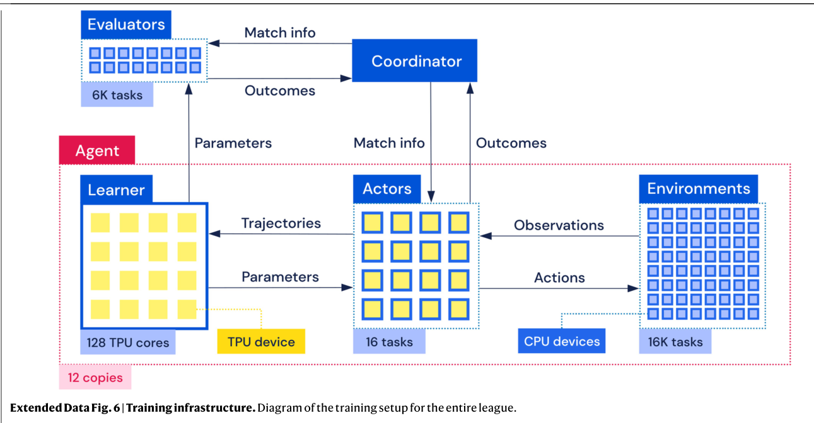

# Architecture

The policy of AlphaStar is a function π_θ(at | st,z) that maps all previous observations and actions s_t = o1:t, a_1:t−1 (defined in EDT 1, 2) and z (representing strategy statistics) to a probability distribution over actions a_t for the current step. π_θ is implemented as a deep neural network with the following structure. 

The observations o_t are encoded into vector representations, combined, and processed by a deep LSTM, which maintains memory between steps. The action arguments a_t are sampled auto-regressively, conditioned on the outputs of the LSTM and the observation encoders. There is a value function for each of the possible rewards (see Reinforcement learning). 

Architecture components were chosen and tuned with respect to their performance in supervised learning, and include many recent advances in deep learning architectures. A high-level overview of the agent architecture is given in EDF 3, with more detailed descriptions in Supplementary Data, Detailed Architecture. AlphaStar has 139 million weights, but only 55 million weights are required during inference. Ablation Fig. 3f compares the impact of scatter connections, transformer, and pointer network.

# Supervised learning

Each agent is initially trained through supervised learning on replays to imitate human actions. Supervised learning is used both to initialize the agent and to maintain diverse exploration. Because of this, the primary goal is to produce a diverse policy that captures StarCraft’s complexities.

We use a dataset of 971,000 replays played on StarCraft II versions 4.8.2 to 4.8.6 by players with MMR scores (Blizzard’s metric, similar to Elo) greater than 3,500, that is, from the top 22% of players. Instructions for downloading replays can be found at https://github.com/ Blizzard/s2client-proto. The observations and actions are returned by the game’s raw interface (EDT 1, 2). We train one policy for each race, with the same architecture as the one used during reinforcement learning.

From each replay, we extract a statistic z that encodes each player’s build order, defined as the first 20 constructed buildings and units, and cumulative statistics, defined as the units, buildings, effects, and upgrades that were present during a game. We condition the policy on z in both supervised and reinforcement learning, and in supervised learning we set z to zero 10% of the time.

To train the policy, at each step we input the current observations and output a probability distribution over each action argument (Extended Data Table 2). For these arguments, we compute the KL divergence between human actions and the policy’s outputs, and apply updates using the Adam optimizer57. We also apply L2 regularization58. The pseudocode of the supervised training algorithm can be found in Supplementary Data, Pseudocode.

We further fine-tune the policy using only winning replays with MMR above 6,200 (16,000 games). Fine-tuning improved the win rate against the built-in elite bot from 87% to 96% in Protoss versus Protoss games. The fine-tuned supervised agents were rated at 3,947 MMR for Terran, 3,607 MMR for Protoss and 3,544 MMR for Zerg. They are capable of building all units in the game, and are qualitatively diverse from game to game (EDF 4).

# Reinforcement learning

We apply reinforcement learning to improve the performance of AlphaStar based on agent-versus-agent games. We use the match outcome (−1 on a loss, 0 on a draw and +1 on a win) as the terminal reward r_T, without a discount to accurately reflect the true goal of winning games. Following the actor–critic paradigm, a value function V_θ(s_t, z) is trained to predict r_t, and used to update the policy π_θ(at | s_t, z).
 
StarCraft poses several challenges when viewed as a reinforcement learning problem: exploration is difficult, owing to domain complexity and reward sparsity; policies need to be capable of executing diverse strategies throughout training; and off-policy learning is difficult, owing to large time horizons and the complex action space.

# Exploration and diversity.

We use human data to aid in exploration and to preserve strategic diversity throughout training. First, we initialize the policy parameters to the supervised policy and continually minimize the KL divergence between the supervised and current policy. Second, we train the main agents with pseudo-rewards to follow a strategy statistic z, which we randomly sample from human data. These pseudo-rewards measure the edit distance between sampled and executed build orders, and the Hamming distance between sampled and executed cumulative statistics (see Supplementary Data, Detailed Architecture). Each type of pseudo-reward is active (that is, non-zero) with probability 25%, and separate value functions and losses are computed for each pseudo-reward. We found our use of human data to be critical in achieving good performance with reinforcement learning (Fig. 3e).

# Value and policy updates.

New trajectories are generated by actors. Asynchronously, model parameters are updated by learners, using a replay buffer that stores trajectories. Because of this, AlphaStar is subject to off-policy data, which potentially requires off-policy corrections. We found that existing off-policy correction methods can be inefficient in large, structured action spaces such as that used for StarCraft, because distinct actions can result in similar (or even identical) behaviour. We addressed this by using a hybrid approach that combines off-policy corrections for the policy (which avoids instability), with an uncorrected update of the value function (which introduces bias but reduces variance). Specifically, the policy is updated using V-trace and the value estimates are updated using TD(λ) (ablation in Fig. 3i). When applying V-trace to the policy in large action spaces, the off-policy corrections truncate the trace early; to mitigate this problem, we assume independence between the action type, delay, and all other arguments, and so update the components of the policy separately. To decrease the variance of the value estimates, we also use the opponent’s observations as input to the value functions (ablation in Fig. 3k). Note that these are used only during training, as value functions are unnecessary during evaluation.

# Multi-agent learning

League training is a multi-agent reinforcement learning algorithm that is designed both to address the cycles commonly encountered during self-play training and to integrate a diverse range of strategies. During training, we populate the league by regularly saving the parameters from our agents (that are being trained by the RL algorithm) as new players (which have fixed, frozen parameters). We also continuously re-evaluate the internal payoff estimation, giving agents up-to-date information about their performance against all players in the league (see evaluators in EDF 6).

# Prioritized fictitious self-play

# Populating the league.

During training we used three agent types that differ only in the distribution of opponents they train against, when they are snapshotted to create a new player, and the probability of resetting to the supervised parameters. Main agents are trained with a proportion of 35% SP, 50% PFSP against all past players in the league, and an additional 15% of PFSP matches against forgotten main players the agent can no longer beat and past main exploiters. If there are no forgotten players or strong exploiters, the 15% is used for self-play instead. Every 2 × 109 steps, a copy of the agent is added as a new player to the league. Main agents never reset. League exploiters are trained using PFSP and their frozen copies are added to the league when they defeat all players in the league in more than 70% of games, or after a timeout of 2 × 109 steps. At this point there is a 25% probability that the agent is reset to the supervised parameters. The intuition is that league exploiters identify global blind spots in the league (strategies that no player in the league can beat, but that are not necessarily robust themselves).

Main exploiters play against main agents. Half of the time, and if the current probability of winning is lower than 20%, exploiters use PFSP with f_var weighting over players created by the main agents. This forms a curriculum that facilitates learning. Otherwise there is enough learning signal and it plays against the current main agents. These agents are added to the league whenever all three main agents are defeated in more than 70% of games, or after a timeout of 4 × 10^9 steps. They are then reset to the supervised parameters. Main exploiters identify weaknesses of main agents, and consequently make them more robust.
For more details refer to the Supplementary Data, Pseudocode.
